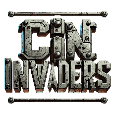

  

Kiev teve um longo dia de trabalho; após horas, ele foi o último a sair do CIN. No entanto, logo percebeu que estava em perigo. O CIN foi invadido por uma inteligência artificial maligna, que controlava seu exército de robôs. Além disso, Kiev havia perdido seu crachá para fugir do CIN. Mas, com muita sorte, Kiev sempre anda preparado...
## Capturas de Tela

  
  
  

## Membros: 
* Vinicious Lidignton (vasll)
* João Henrique S. Ebbers (jhse)
* João Victor (jvca2)
* Marcelo Melo (mcapm)
* Carlos Eduardo (ceft)
* Luiz Miguel (lmgra)
## Divisão de tarefas:
| **Equipe** | **Cargo** | **Tarefas** |
| :---: | :--: |:--:|
| vasll | Project Lead | Relatório e planejamento da apresentação |
| jhse | Desenvolvedor/Programador | Código principal do jogo e classes |
| jvca2 | Desenvolvedor/Programador | Código principal do jogo e classes |
| mcapm | Desenvolvedor/Programador | Menu do jogo |
| ceft | Art Director | Design do jogo, correção de bugs |
| lmgra | QA Tester e Art & Sound Director| Encontrar e corrigir bugs, implementação do áudio |
## Ferramentas, Frameworks e bibliotecas: 
* Pygame
> A biblioteca Pygame é um conjunto de módulos criado especificamente para escrever jogos e programas multimídia usando a linguagem Python. Essa biblioteca fornece ferramentas e funcionalidades para lidar com gráficos, som, entrada do usuário e outros aspectos essenciais de desenvolvimento de jogos.
* Pygame_gui
> O pygame_gui é uma biblioteca complementar ao Pygame, projetada para simplificar o desenvolvimento de interfaces gráficas de usuário para jogos e aplicativos criados com Pygame. Ele fornece uma estrutura de interface de usuário leve e flexível, e no nosso código facilitou a criação do menu do jogo, com funções para implementar botões, caixas de texto e outros elementos de interface comuns.
* Numpy
> Numpy é uma biblioteca que oferece uma ampla variedade de funções e ferramentas para realizar operações matemáticas e computacionais eficientes. Em nosso código foi utilizada a sua função randint, que gera números de forma aleatória de forma eficiente e uniforme.
* Os
> Este módulo fornece uma maneira simples de usar funcionalidades que são dependentes do sistema operacional. Em nosso código foi usado para manipular pastas e aquivos, checando o tamanho dessas pastas.
* Math
> Essa biblioteca fornece acesso a funções matemáticas definidas pelo padrão C. Ela inclui funções para realizar cálculos matemáticos básicos como raízes quadradas, logarítmos e trigonometria, no nosso código foram utilizadas principalmente funções trigonométricas para definir a trajetória dos ataques do boss. 
## Organização do código
Trata-se de um código modular dividido em três funções principais com os loops do jogo, a função principal com a lógica do jogo (play()), a função que contém o loop do menu do jogo e uma função com o loop para rodar a introdução. A única função que é chamada é a função intro() e a partir delas as outras funções são chamadas.
Além do módulo principal, o código contém mais 5 módulos que compõem o jogo:
* player_script
> esse é o arquivo que contém a classe do player e dos inimigos, ambas muito semelhantes e contando com métodos de update(), draw(), move(), shoot() e a classe dos inimigos contendo o método extra ai(), que dita o movimento automático dos inimigos.
* boss_script
> esse módulo é bastante semelhante ao player_script, contendo a classe do boss, seus métodos de ataque shoot_laser(), shoot_missil() e laser_beam(), além do seus métodos de update(), draw() e ai().
* vida_script
> esse módulo contém tanto a classe da barra de vida do player, quanto a classe do coletável que concede vida para o jogador, a coxinha. Ambas essas classes possuem seus métodos de update() e draw(), e para a classe da coxinha uma função extra, gerar_coxinhas(), que diz se novos itens de cura vão ser gerados com base em uma probabilidade.
* weapons
> esse arquivo conta com a classe da arma coletável Shotgun(), da animação de tiro dela, ShotgunBlast() e também as classes dos projéteis que o boss dispara, as classes Missil, Explosão e Laser. Todas essas classes tem suas funções de update() e draw(). A classe Shotgun, semelhante a classe Coxinha, tem a função gerar_shotgun(), que se o player não estiver equipado com essa arma gera aleatoriamente novas armas com base em uma probabilidade.
* keycard
> esse módulo é o que contém a classe Keycard, que é o último coletável do jogo, ele só aparece na tela se o boss for derrotado e quando é coletádo o jogador zera o jogo. Essa classe possui as funções update() e draw().
## Conceitos:
* Programação Orientada a Objetos
> POO é um paradigma da programação baseado no conceito de objetos, cada objeto é definido através de uma classe e essa classe contém os atributos e métodos desse objeto. Esse conceito cumpre um papel fundamental da organização do nosso código, uma vez que todos os objetos do jogo foram definidos em suas respectivas classes, o que facilitou bastante para implementar suas funções no loop principal do jogo.
* Laços de Repetição
> Podem ser usados no código a partir dos comandos **for** e **while**, estas estruturas permitem a execução de instruções repetidas vezes, até que uma condição seja atingida. Dentro do jogo essa função cumpre um papel essencial, que se trata do loop principal onde ocorrem as mudanças como a movimentação do jogador e a atualizações do jogo, essa conceito também foi utilizado dentro de algumas classes para implementar as animações do jogo.
* Estruturas Condicionais
> Podem ser usados no código a partir dos comandos **if**, **elif** e **else**, esta estrutura permite a checagem de preposições, quando uma condição é verdade ou não ela executará o trecho de código atrelado a essa condição. Dentro do jogo esse conceito é usado várias vezes, como exempo a checagem de teclas pressionadas no loop principal, a geração de novos itens e a programação dos métodos de movimentação dos inimigos.
* Funções
> Podem ser usadas no código apenas se definidas previamente com a sintaxe **def()**, a partir de sua definição podemos chamá-la quantas vezes forem necessárias dentro do código utilizando apenas o nome que foi dado a ela no momento de sua definição. Sendo inprescindível em qualquer programa com um conjunto de comandos que se repita muitas vezes, como é o caso do nosso jogo.
## Desafios:
* Qual foi o maior erro cometido durante o projeto? Como vocês lidaram com ele?
> Não tivemos nenhum erro majoritário que comprometeu o codigo e desenvolvimento do jogo. Porém, ao implementar o fluxo de animações (houveram  erros nas codições de cada ação, gerando conflito entre elas), bugs no campo de visão (update antes de virar a posição do inimigo) que resultavam no personagem atirar de costas. Erros na coleta de coxinha(+vida) ao ter vida máxima. Erros em posicionar a colisão do jogo principalmente ao agachar, que causou um bug no qual o personagem caia ao morrer. Todos erros foram consertados através da revisão da lógica do código e vários testes de erro e tentativa.
* Qual foi o maior desafio enfrentado durante o projeto? Como vocês lidaram com ele?
> Refazer a classe pra se adequar ao sistema de spritesheet
Adequar-se a disponibilidade do tempo entre os integrantes, muitos trabalhos dependiam uns dos outros.
* Quais as lições aprendidas durante o projeto?
> Aprendemos a utilizar programação orientada a objetos, e fazer um código modular utilizando diversas bibliotecas, módulos e pacotes.
AMOR, AMIZADE ,COMPAIXÃO, DISCIPLINA, FOCO...

#
###### _Projeto referente a cadeira de Programação 1/CIN-UFPE no período 2023.2._
